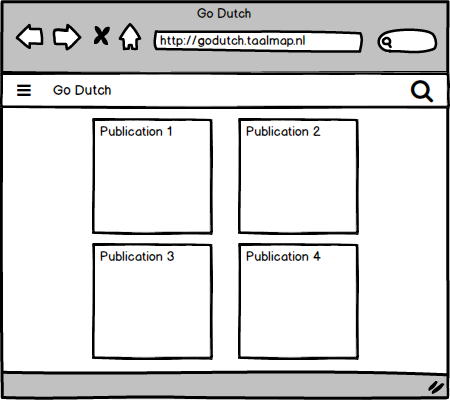
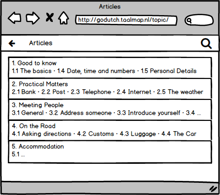
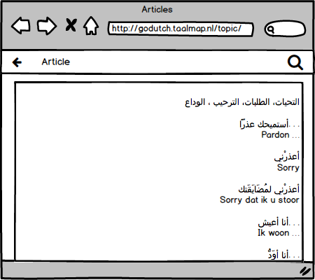
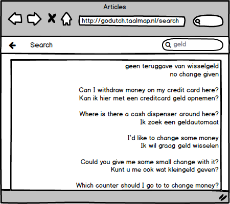

# Go Dutch Project for HackYourFuture

## Introduction

This repo contains a plan and resources for building a full-stack application, to be delivered by HackYourFuture students from Class 7 as their graduation project.

The application targets learners of the Dutch language. It should allow users to browse and search bilingual texts and hear Dutch pronunciation of phrases by utilizing text-to-speech capabilities of the browser.

While delivering learning content (i.e. bilingual texts) is not a core part of the project it is envisioned that appropriate texts would focus on practical matters encountered by newcomers in the Netherlands.

## The Assignment

The assignment is to build the target application from (almost) scratch. The technology stack to be used consist of:

1. Angular, TypeScript and Angular Material for the front end
2. Node.js, Express and ES6 for the back end
3. MySQL for the database layer

The content format (bilingual texts) will be in the Markdown format. Two sets of starter Markdown files will be provided. The first set consists of English-Dutch texts and second of Arabic-Dutch texts. For the latter texts the application should switch to a right-to-left presentation.

A command line tool ('parser') will be provided that reads the markdown files and populates the appropriate SQL tables with data. This tool will take the form of a minified JavaScript file. If time permits the project team will be asked to reverse engineer this tool with their own implementation.

A working example of the full application can be seen at [http://godutch.taalmap.nl](http://godutch.taalmap.nl).

## Project Plan

In the first four weeks project team members will each develop the application independently, however team members are encouraged to compare notes, seek each other's advice, peer program etc. during the week. During the Sunday session at the end of each of the first four weeks the team members will review each other's work and select one to be enhanced together during the remainder of session and for all to adopt as basis for ongoing development during the next week. 

In the last two weeks the team members will work collaboratively on a single, shared version and divide the outstanding remaining work for delivery at project conclusion.

### Week 1

- Project front end scaffolding with Angular CLI
- Familiarization with Angular Material 2
- Build an initial page with a toolbar, a sidenav and a search button (see Figure 1 below), but still without content

### Week 2

- Build the Publication List and Article List pages (Figures 1, 2)
- Use a provided RESTFUL API end point as back end (to be replaced later by a custom implementation)

### Week 3

- Build the Article Page (Figure 3) and the text-to-speech functionality.

### Week 4

- Implement the Search Page (Figure 4)

### Week 5

- Replace the provided RESTFUL API end point with a custom implementation, as a collaborative team effort. A database schema will be provided.

### Week 6

- Tie up any loose ends and deliver the product for demonstration.

### Bonus

- If time permits, develop a custom implementation of the content parser.

## User Interface Overview

### Home page - Publication List

Figure 1.

This page show a list of cards, where each card consist of bibliographical information such as product image, title, subtitle, author etc. Clicking on a card shows the page below.

### Article List

Figure 2.

This page consist of a list of articles available within the selected publication. Each list item consist of a title (the article's `h1` heading) and a subtitle (a concatenation of the `h2` headings within the article).

### Article Page

Figure 3.

This page displays the content of an article. Content is created as stand-alone markdown files, loaded into the database by the content parser and converted on the fly to HTML by the back end. Content files include meta data, amongst others the nativate (e.g. `en-GB`) and target languages (e.g. `nl-NL`) contained in the document. This information is used to select the appropriate text-to-speech voices.

### Search Page

Figure 4.

Through this page the user can search for paragraphs (from content documents) that contain the search term.